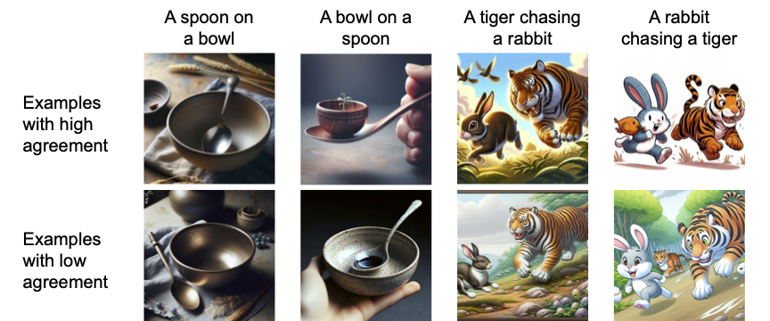

# Evaluating Compositional Scene Understanding in Multimodal Generative Models
This is the official implementation of [Fu, S.,* Lee, A.J.,* Wang, A., Momennejad, I., Bihl, T., Lu, H., & Webb, T., (in press). Evaluating Compositional Scene Understanding in Multimodal Generative Models. _Transactions of Machine Learning Research_](https://openreview.net/forum?id=7bIfe2I7bK)

## Abstract
The visual world is fundamentally compositional. Visual scenes are defined by the composition of objects and their relations. Hence, it is essential for computer vision systems to reflect and exploit this compositionality to achieve robust and generalizable scene understanding. While major strides have been made toward the development of general-purpose, multimodal generative models, including both text-to-image models and multimodal vision-language models, it remains unclear whether these systems are capable of accurately generating and interpreting scenes involving the composition of multiple objects and relations. In this work, we present an evaluation of the compositional visual processing capabilities in the current generation of text-to-image (DALL-E 3) and multimodal vision-language models (GPT-4V, GPT-4o, Claude Sonnet 3.5, QWEN2-VL-72B, and InternVL2.5-38B), and compare the performance of these systems to human participants. The results suggest that these systems display some ability to solve compositional and relational tasks, showing notable improvements over the previous generation of multimodal models, but with performance nevertheless well below the level of human participants, particularly for more complex scenes involving many (>5) objects and multiple relations. These results highlight the need for further progress toward compositional understanding of visual scenes.

 

Figure 1. Examples of images from Experiment 2 generated by DALL-E 3 for basic relational prompts and their corresponding reversed prompts (which have a lower log-likelihood of occurrence). As noted in our paper, people think that images from less likely prompts match the prompt less often (i.e., lower agreement).

## Overview
This repository contains the following things:
1. All code used to evaluate vision-language models
2. All code used to analyze the data generated by vision-language models
3. The prompts used to generate images with DALL-E 3
4. The images generated by DALL-E 3
5. The figures/plots of our paper

## Understanding the Repository Structure
The repository is divided into two main folders:
1. Scene generation
2. Scene classification

### Scene Generation
Under `scene_generation`, you will find all files related to our evaluation of DALL-E 3. Here, you will find three subfolders: stimuli, prompt_probabilities, and dalle_agreement_data_anlaysis_cleaned. 

1. `stimuli` - refers to the prompts used for each of our three experiments
2. `prompt_probabilities` - contains a single file that generates log-probabilities for all prompts using various OpenAI models
3. `dalle_agreement_data_analysis_cleaned` - contains the data from each our of human experiments (evaluating DALL-E 3's images) and the analysis code that examines this data

### Scene Classification
Under `scene_classification`, you will find all the files related to our evaluation of chat models. There are two folders, one for each scene classification dataset: `svrt` and `bongard_hoi`. Both have a similar directory structure. Under `svrt` as an example, you will then see a folder for each of the models tested, for human data, and for a combined analysis across models and humans. Please look at `claude-3.5-sonnet` as a representative folder. There, you will see the following items:

1. `run_fewshot_cot0.py` - evalautes Claude on the SVRT dataset, without chain-of-thought prompting. Here, the suffix `cot0` refers to "no chain-of-thought."
2. `utils_fewshot_cot0.py` - contains various helper functions utilized by `run_fewshot_cot0.py`
3. `results` - contains the results of evaluating Claude on the SVRT dataset. Here, the only important item is `23_fewshot_results.csv`.

This folder structure applies to `internvl-38b` and `Qwen2-VL-72B`. For `gpt-4o` and `gpt-4-vision-preview`, the folder structure is slightly different. Each of these folders contains two subfolders: `fewshot` and `interactive`.

- `fewshot` - contains all of the files used to evaluate the model on the few-shot setup of the SVRT
- `interactive` - contains the files used to evaluate on the human-like setup of the SVRT, which is reported in the Supplmental Information section of the paper

Inside `fewshot` and `interactive`, the folder structure is nearly identical as `claude-3.5-sonnet`. You will see filenames with the suffixes `cot1`, `cot2`, and `cot3`, referring to chain-of-thought levels 1, 2, and 3, as detailed in the paper. We did not evaluate non-gpt-4 models on different levels of chain-of-thought prompting, as it did not improve classification accuracy. 

You will also see a file that ends in the suffix `swap`. This refers to the experiment when we swapped the category answer labels for each image to test the hypothesis that the models' performance on the datasets could be due to memorization of the datasets (see Supplemental Information).

## Evaluating Vision-Language Models
To evaluate the models on scene classification, open any file that starts with the prefix `run_`. Input your API key, base, and deployment name for the closed-source models. You do not need to do so for the open-source models (Qwen and InternVL). Save the file, and then run it. If you encounter any issues, please do not hesitate to email me at `andrewlee0@g.ucla.edu`. I would be more than happy to assist with any errors that arise!

